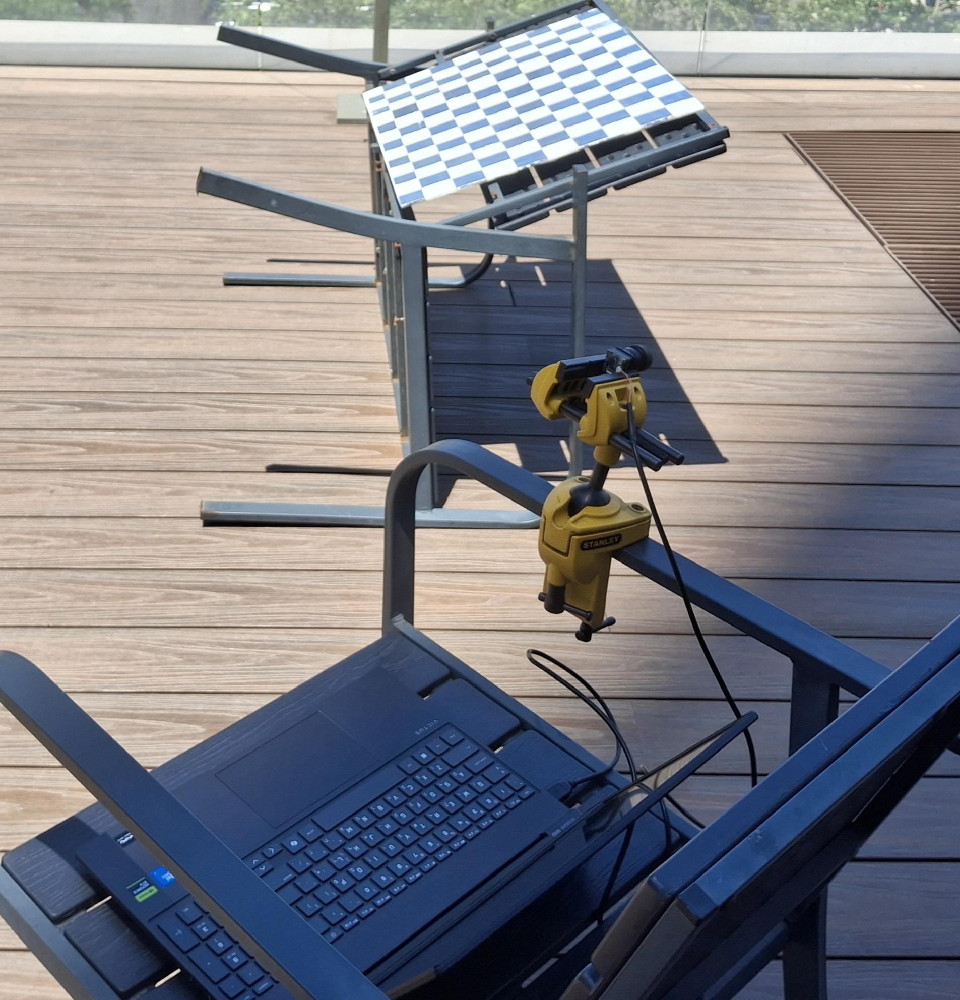
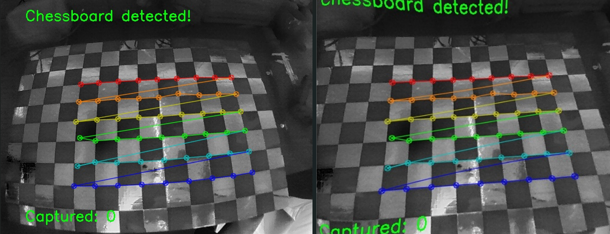

# Thermal Camera Calibration Toolbox

This repository contains a specialized toolset for capturing calibration images and computing intrinsic camera matrices and distortion coefficients for **Thermal / Infrared Cameras** using OpenCV. 

Standard webcams process color data easily, but thermal sensors often present low native resolutions, blur from hardware upscaling, and an inability to see standard printed ink. This toolbox solves these issues using a dynamic **CLAHE (Contrast Limited Adaptive Histogram Equalization)** filter for edge enhancement and forces a **DirectShow** backend configuration to bypass buggy Windows Media Foundation interfaces.

---
## camera params:  
HIK UR camera
Resolution:  640x512
Measured FPS: 49.94  (120 frames in 2.40s)


## Project Structure

```text
camera-calibration-main/
│
├── capture_calibration_images.py   # Step 1: Live stream & image capture tool
├── camera_calibration.py           # Step 2: Math processing & undistortion script
├── README.md                       # This file
│
├── calibration_images/             # Generated automatically (Contains raw captured frames)
└── output/                         # Generated automatically (Contains matrices, coefficients, and logs)
    └── undistorted/                # Subdirectory containing test images with distortion removed

```

---

## Prerequisites & Installation

For optimal performance with thermal camera hardware interfaces, **running this project natively on Windows** (via PowerShell or Command Prompt) instead of WSL is highly recommended.

1. Ensure Python 3.x is installed on your Windows machine.
2. Install the required computer vision and numerical dependencies:

```powershell
pip install opencv-python numpy

```

---

## Step-by-Step Workflow

### Step 1: Prepare a "Thermal-Visible" Target



Standard paper chessboards are invisible to thermal sensors because the entire flat sheet rests at a uniform temperature. To generate a high-contrast edge grid, use one of the following methods:

* **The Heat Absorber:** Put the target under the sun for 10 min. The black squares will absorb thermal energy significantly faster than the white squares, creating a brief window of high contrast.
* **The Reflective Aluminum Array:** Paste squares of dark electrical tape or heavy cardboard onto a sheet of flat aluminum or a baking tray. The metal reflects environmental temperatures ("cold"), while the tape emits normal ambient heat, creating a crisp, permanent thermal edge signature.

### Step 2: Capture Calibration Data

Run the image capture script to open a live thermal preview pane:

```powershell
python capture_calibration_images.py

```

* **Controls:** * Position your physical target in frame. The integrated CLAHE filter will optimize local edge curves. When a complete grid is identified, a green coordinate mesh overlay will appear.
* Press **`c`** to capture a clean frame. Try to collect **15 to 20 images** from multiple angles (tilted left, right, high, low, close, and far).
* Press **`q`** or **`Esc`** to save your changes and terminate the stream.


### Step 3: Compute Intrinsic Calibration Matrices

Once your `calibration_images/` directory contains your sample photos, execute the processing engine:

```powershell
python camera_calibration.py

```

The script parses every saved frame, refines corner pixels using sub-pixel interpolation (`cv2.cornerSubPix`), maps them to real-world dimensions (defaulting to 2.5 cm squares), and runs the structural calibration math.

---

## Outputs & Calibration Results



Once processing wraps up successfully, your calculated metrics will be exported into the newly generated `output/` folder:

* **`camera_matrix.txt`**: A $3\times3$ text matrix representing focal lengths ($f_x, f_y$) and principal optical centers ($c_x, c_y$).
* **`distortion_coefficients.txt`**: Five calculated values ($k_1, k_2, p_1, p_2, k_3$) defining radial and tangential lens distortion.
* **`calibration_data.pkl`**: A Python pickle payload containing all structural components (`mtx`, `dist`, `rvecs`, `tvecs`) for simple deployment inside other tracking scripts.
* **`output/undistorted/`**: Contains duplicates of your input images processed through an inverse mapping algorithm to straighten barrel or pincushion distortion.

---


```
